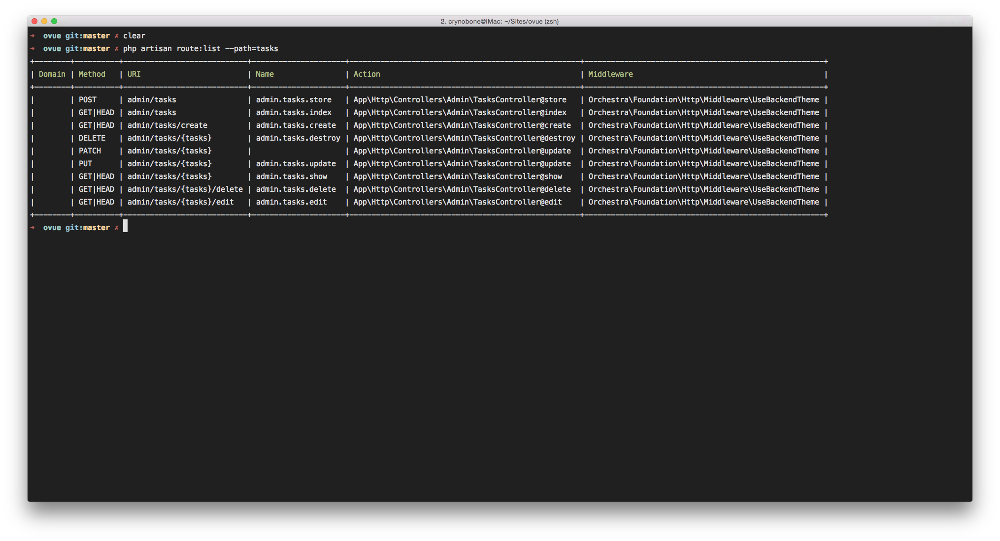

# Build an App with Orchestra Platform 3

## Table of Content

* [Install Orchestra Platform & Create New Project](#install-orchestra-platform--create-new-project)
    - [Install Studio](#install-studio)
    - [Install Lumen](#install-lumen)
* [Setup DB, Create Migration & Insert Dummy Data](#setup-db-create-migration--insert-dummy-data)
    - [Setup DB](#setup-db)
    - [Create Migration](#create-migration)
    - [Insert Dummy Data](#insert-dummy-data)

## Install Orchestra Platform & Create New Project

First Install Composer By Following [this guide](https://getcomposer.org/doc/00-intro.md).

Then, download the Lumenate installer using Composer.

    composer global require "orchestra/lumenate=^0.1"

Once successfully installed, you can type composer create project command to create new Orchestra Platform project (we'll be using `ovue` as the project name).

    composer create-project orchestra/platform ovue 3.1.x --prefer-dist

After successfully creating the project, make sure your webserver is running (we will be using the serve command for now), now go into the project directory and type.

    php artisan serve

Now you can open the following url <http://localhost:8000>, and you will see the Orchestra Platform front page.

### Install Studio

Now we will add a package called [Studio](https://github.com/orchestral/studio). This Orchestra Platform package provides a variety of generators to speed up your development process. You can install the package via composer as:

    composer require "orchestra/studio=~3.1" --dev

Now create a new `resources/config/local/app.php` file and include the following:

```php
<?php 

return [
    'providers' => append_config([
        Orchestra\Studio\StudioServiceProvider::class,
    ]),
];
```

Now run `php artisan`. You should see new commands added in the make:* section.

### Install Lumen

Now, you can also setup Lumen for Orchestra Platform by running the following command.

    lumenate install

Once `orchestra/lumen` is installed, you can run the following command to insert the app skeleton code (which will be added under `lumen` directory).

    lumenate make

Next, we need to update `composer.json` to include new autoload directories.

```json
    "autoload": {
        "classmap": [
            "resources/database"
        ],
        "psr-4": {
            "App\\Lumen\\": "lumen/app/",
            "App\\": "app/"
        }
    },
    "autoload-dev": {
        "classmap": [
            "lumen/tests/LumenTestCase.php",
            "tests/TestCase.php"
        ]
    },
```

Don't forget to run `dump-autoload` to include the new paths.

    composer dump-autoload

To test if Lumen was successfully installed, run the following command:

    php lumen/artisan serve

Now you can open the following url <http://localhost:8000>, and you will see the Lumen front page.

## Setup DB, Create Migration & Insert Dummy Data

### Setup DB

now open the `.env` file and change the following:-

```
DB_HOST=localhost
DB_DATABASE=ovue    # Your Database Name
DB_USERNAME=root    # Your Database Username
DB_PASSWORD=root    # Your Database Password
```

Now let's run `php artisan serve` and setup administrator account for this project from <http://localhost:8000/admin/install>.


### Create Migration

Next step is to create the migration, as the laravel documentation says, Migrations are like version control for your database, allowing a team to easily modify and share the application’s database schema. Open the terminal and type the following command to create the model and (migration).

    php artisan make:model Task -m

The model will be generated under `app/Task.php`.

```php
<?php 

namespace App;

use Illuminate\Database\Eloquent\Model;

class Task extends Model
{
    //
}
```

You can see the created migration in `resources/database/migrations` folder. Open the migration file and replace it with this code

```php
<?php

use Illuminate\Database\Schema\Blueprint;
use Illuminate\Database\Migrations\Migration;

class CreateTasksTable extends Migration
{
    /**
     * Run the migrations.
     *
     * @return void
     */
    public function up()
    {
        Schema::create('tasks', function (Blueprint $table) {
            $table->increments('id');
            $table->unsignedInteger('user_id')->index();
            $table->string('body');
            $table->timestamps();
        });
    }

    /**
     * Reverse the migrations.
     *
     * @return void
     */
    public function down()
    {
        Schema::drop('tasks');
    }
}
```

Here you can see we have added the `id`, `name`, `user_id` and `timestamps` fields. Where id is auto incrementing, `body` is the body of the task and `user_id` will be used for the user who will submit the task. Here there are two functions one is up and other is down. The down function is the exact opposite of the up and will be used if we want to revert back the migration.

Now run the following commands.

    php artisan migrate

Now have a look at the database, you can see the new `tasks` table there. Along with `tasks` table, Orchestra Platform creates eight other migrations.


Now to demonstrate the down function. Let’s say we want to change the `body` field with `name`. What you can do is, change the field in the migration table.

```php
    public function up()
    {
        Schema::create('tasks', function (Blueprint $table) {
            $table->increments('id');
            $table->unsignedInteger('user_id')->index();
            $table->string('name');
            $table->timestamps();
        });
    }
```

Now run the following commands.

    php artisan migrate:rollback
    php artisan migrate

Now open the database and check the structure and you can see the `tasks` table `body` field renamed to `name`.

### Insert Dummy Data

The next step is to insert the dummy data that we can use throughout the  development process. For inserting dummy data we will use a package called [fzaninotto/faker](https://github.com/fzaninotto/Faker).

First we need to install this package:

    composer require "fzaninotto/faker=~1.5"

Now create the seed file which will be used to insert dummy data.

    php artisan make:seed TasksTableSeeder

You can see the created seeder file in `resources/database/seeds` folder. Open `TasksTableSeeder.php` and add the following.

```php
<?php

use App\Task;
use Illuminate\Database\Seeder;

class TasksTableSeeder extends Seeder
{
    /**
     * Run the database seeds.
     *
     * @return void
     */
    public function run()
    {
        $faker = Faker\Factory::create();

        foreach (range(1, 30) as $index) {
            $now = Carbon\Carbon::now();

            Task::create([
                'name' => $faker->sentence(6),
                'user_id' => $faker->numberBetween(1, 5),
                'created_at' => $now,
                'updated_at' => $now,
            ]);
        }

    }
}
```

At the top you can see, we have added `App\Task` that makes us available the tasks model and we are using to create new tasks as `Task::create`. Here you can see we have used `$faker` object, it is availabe through package. For the list of all the available functions, you can have a look at their [documentation](https://github.com/fzaninotto/Faker#installation).

Now Create the new seed file for users table as.

    php artisan make:seed UsersTableSeeder

Now open `UsersTableSeeder.php` and add the following.

```php
<?php

use App\User;
use Illuminate\Database\Seeder;

class UsersTableSeeder extends Seeder
{
    /**
     * Run the database seeds.
     *
     * @return void
     */
    public function run()
    {
        $faker = Faker\Factory::create();
        $role = Orchestra\Model\Role::member();

        foreach (range(1, 4) as $index) {
            $now = Carbon\Carbon::now();
            $user = User::create([
                'fullname' => $faker->name(),
                'email' => $faker->email,
                'password' => bcrypt('secret'),
                'created_at' => $now,
                'updated_at' => $now,
            ]);

            $user->attachRole($role->id);
            $user->save();
        }
    }
}

```

The next step is to open `DatabaseSeeder.php` and add the created seeder class.

```php
    /**
     * List of seeders.
     *
     * @var array
     */
    protected $seeders = [
        TasksTableSeeder::class,
        UsersTableSeeder::class,
    ];
```

Now the last step is to run the db seed command as.

    php artisan db:seed

After that you can see the database table with all the dummy entries.

## Creating & Testing Routes

In the last section we successfully created the database, created migration and prepared seeder classes. In this section we will create our backend routes which we can hit to get data.

Let's create `app/Http/backend.php` route file and add the following code:

```php
<?php

$router->resource('tasks', 'TasksController');
```

In order for Orchestra Platform to load `backend.php`, let's open up `app/Providers/RouteServiceProvider.php` and edit the following code:

```php
    /**
     * Define the routes for the application.
     *
     * @param  \Illuminate\Routing\Router  $router
     *
     * @return void
     */
    public function map(Router $router)
    {
        $this->loadFrontendRoutesFrom(app_path('Http/routes.php'));
        $this->loadBackendRoutesFrom(app_path('Http/backend.php'), "{$this->namespace}\\Admin");
    }
```

Now we need to create the `TasksController`, for this we will use generators:

    php artisan make:controller Admin/TasksController

This command will create the `TasksController` with all the required methods. Now run this command and see the output.

    php artisan route:list --path=tasks


